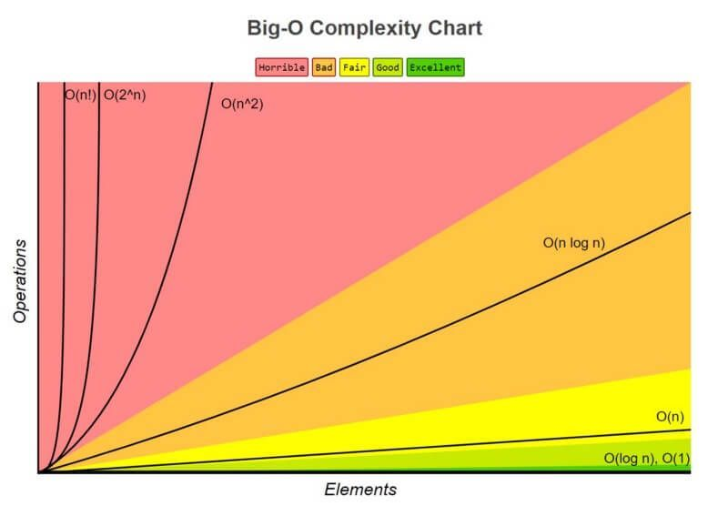

⚡️ Seu código é rápido ou travado? Nesse repositório você aprenderá a famosa notação Big O.

Notação Big O, uma ferramenta importante para medir o desempenho de algoritmos📊. Ela ajuda os desenvolvedores a 
entenderem como a eficiência de um algoritmo muda à medida que a quantidade de dados aumenta.

Aqui estão os principais tipos de notação que você precisa conhecer:\
📌 O(1) → Complexidade constante.\
📌 O(log n) → Complexidade logarítmica.\
📌 O(n) → Complexidade linear.\
📌 O(n log n) → Complexidade linearítmica.\
📌 O(n²) → Complexidade quadrática.\
📌 O(2ⁿ) → Complexidade exponencial.\
📌 O(n!) → Complexidade fatorial.

💡 Dica: Quanto menor a complexidade, mais rápido o algoritmo tende a ser em grandes escalas.

